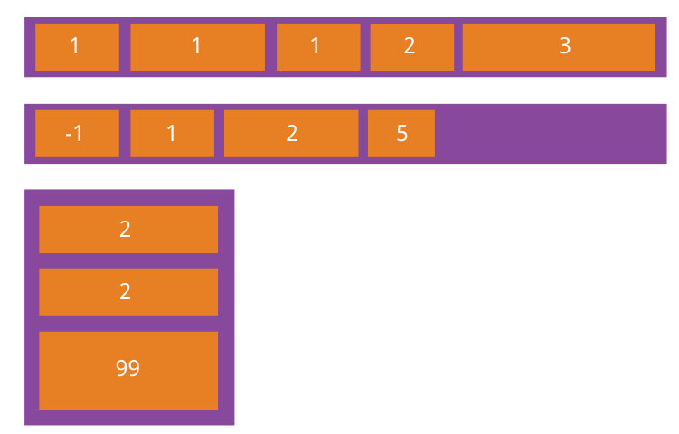
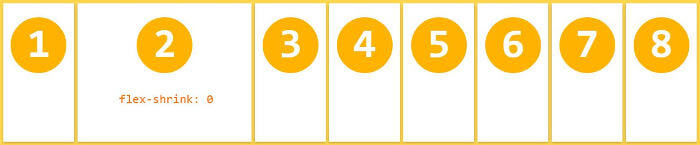

## 项目的属性

以下6个属性设置在项目上。

- `order`
- `flex-grow`
- `flex-shrink`
- `flex-basis`
- `flex`
- `align-self`

### 1. order属性

`order`属性定义项目的排列顺序。数值越小，排列越靠前，默认为`0`。

```css
.item {
  order: <integer>;
}
```



### 2. flex-grow属性

`flex-grow`属性定义项目的放大比例，默认为`0`，即如果存在剩余空间，也不放大。

```css
.item {
  flex-grow: <number>; /* default 0 */
}
```


如果所有项目的`flex-grow`属性都为1，则它们将等分剩余空间（如果有的话）。如果一个项目的`flex-grow`属性为2，其他项目都为1，则前者占据的剩余空间将比其他项多一倍。

### 3. flex-shrink属性

`flex-shrink`属性定义了项目的缩小比例，默认为`1`，即如果空间不足，该项目将缩小。

```css
.item {
  flex-shrink: <number>; /* default 1 */
}
```



如果所有项目的`flex-shrink`属性都为1，当空间不足时，都将等比例缩小。如果一个项目的`flex-shrink`属性为0，其他项目都为1，则空间不足时，前者不缩小。

负值对该属性无效。

### 4. flex-basis属性

`flex-basis`属性定义了在分配多余空间之前，项目占据的主轴空间（main size）。浏览器根据这个属性，计算主轴是否有多余空间。它的默认值为`auto`，即项目的本来大小。

```css
.item {
  flex-basis: <length> | auto; /* default auto */
}
```

它可以设为跟`width`或`height`属性一样的值（比如350px），则项目将占据固定空间。

### 5. flex属性

`flex`属性是`flex-grow`, `flex-shrink` 和 `flex-basis`的简写，默认值为`0 1 auto`。后两个属性可选。

```css
.item {
  flex: none | [ <'flex-grow'> <'flex-shrink'>? || <'flex-basis'> ]
}
```

该属性有两个快捷值：`auto` (`1 1 auto`) 和 `none` (`0 0 auto`)。

建议优先使用这个属性，而不是单独写三个分离的属性，因为浏览器会推算相关值。

### 6. align-self属性

`align-self`属性允许单个项目有与其他项目不一样的对齐方式，可覆盖`align-items`属性。默认值为`auto`，表示继承父元素的`align-items`属性，如果没有父元素，则等同于`stretch`。

```css
.item {
  align-self: auto | flex-start | flex-end | center | baseline | stretch;
}
```


该属性可能取6个值，除了auto，其他都与`align-items`属性完全一致。
