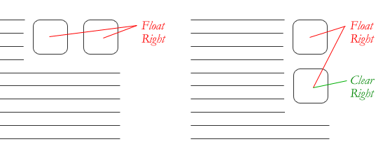

## 什么是CSS Float？

`float` 是 CSS 的定位属性。在传统的印刷布局中，文本可以按照需要围绕图片。一般把这种方式称为“文本环绕”。在网页设计中，应用了CSS的float属性的页面元素就像在印刷布局里面的被文字包围的图片一样。浮动的元素仍然是网页流的一部分。这与使用绝对定位的页面元素相比是一个明显的不同。绝对定位的页面元素被从网页流里面移除了，就像印刷布局里面的文本框被设置为无视页面环绕一样。绝对定位的元素不会 影响其它元素，其它元素也不会影响它，无论它是否和其它元素挨着。


像这样在一个元素上用CSS设置浮动：

```css
#sidebar {
  float: right;
}
```

`float` 属性有四个可用的值：`left` 和 `right` 分别浮动元素到各自的方向，`none` (默认的) 使元素不浮动，`inherit` 将会从父级元素获取float值。

## Float的用处

除了简单的在图片周围包围文字，浮动可用于创建全部网页布局。


Float对小型的布局同样有用。例如页面中的这个小区域。如果我们在我们的小头像图片上使用Float，当调整图片大小的时候，盒子里面的文字也将自动调整位置：


同样的布局可以通过在外容器使用相对定位，然后在头像上使用绝对定位来实现。这种方式中，文本不会受头像图片大小的影响，不会随头像图片的大小而有相应变化。


## 清除Float

清除(`clear`)是浮动(`float`)的相关属性。一个设置了清除Float的元素不会如浮动所设置的一样，向上移动到Float元素的边界，而是会忽视浮动向下移动。如下，一图顶千言。


上例中，侧栏向右浮动，并且短于主内容区域。页脚(footer)于是按浮动所要求的向上跳到了可能的空间。要解决这个问题，可以在页脚(footer)上清除浮动，以使页脚(footer)待在浮动元素的下面。

```css
#footer {
  clear: both;
}
```


清除(`clear`)也有4个可能值。最常用的是 `both`，清楚左右两边的浮动。`left` 和 `right` 只能清楚一个方向的浮动。`none` 是默认值，只在需要移除已指定的清除值时用到。`inherit` 应该时第五个值，不过很奇怪的是 IE 不支持。只清除左边或右边的浮动，实际中很少见，不过绝对有他们的用处。



## 伟大的塌陷

使用浮动(`float`)的一个比较疑惑的事情是他们怎么影响包含他们的父元素的。如果父元素只包含浮动元素，那么它的高度就会塌缩为零。如果父元素不包含任何的可见背景，这个问题会很难被注意到，但是这是一个很重要的问题。


塌陷的直观对立面更不好，看看下面的情况：


当上面的块级元素自动扩展以适应浮动元素时，段落间的文本流中会出现非自然的空白换行，而且没有有效的方法来修正这个问题。对于这种情况，设计师的抱怨会更甚于对塌陷的抱怨。

为了防止怪异的布局和跨浏览器的问题，塌陷问题几乎总是被要处理的。我们在容器中的浮动元素之后，容器结束之前来清除浮动。

## 清除浮动的技术

如果你很明确的知道接下来的元素会是什么，可以使用 `clear:both;` 来清除浮动。这个方法很不错，它不需要 hack，不添加额外的元素也使得它有良好的语义性。当然事情并不是都可以这样解决的，工具箱中还是需要另外几个清除浮动的工具。

- __The Empty Div Method__ 从字面来看，是一个空的 div。 `<div style="clear: both;"></div>`. 有时可能会用 `<br>` 或者一些其他元素，但是 div 是最常用的，因为它没有浏览器默认样式；没有特殊功能，而且一般不会被 CSS 样式化。这个方法因为只是为了表现，对页面没有上下文涵义而被纯语义论者嘲笑。诚然，从严格的角度来说他们是对的，但是这个方法有效而且没有任何伤害。

- __The Overflow Method__ 方法在父元素上设置 `overflow` 这个 CSS 属性。如果父元素的这个属性设置为 `auto` 或者 `hidden`，父元素就会扩展以包含浮动。这个方法有着较好的语义性，因为他不需要额外元素。但是，如果需要增加一个新的 div 来使用这个方法，其实就和空 div 方法一样没有语义了。而且要记住，`overflow` 属性不是为了清除浮动而定义的。要小心不要覆盖住内容或者触发了不需要的滚动条。

- __The Easy Clearing Method__ 使用了一个聪明的 CSS 伪选择符(`:after`)来清除浮动。比起在父元素上设置 overflow，只需要给它增加一个额外的类似于"clearfix"的类。这个类使用如下 CSS:

```css
.clearfix:after {
  content: ".";
  visibility: hidden;
  display: block;
  height: 0;
  clear: both;
}
```

这会在清除浮动的父元素之后应用一点看不见的内容。这不是[全部内容](http://www.positioniseverything.net/easyclearing.html)，还需要一些额外的代码来适应那些老旧的浏览器。

不同的情况需要不同的浮动清除方法。以一个具有不同样式块的网格为例。


为了从视觉上较好的把相似的块联系起来，需要在必要的地方开启新行，这里是颜色改变的地方。如果每个颜色组都有一个父元素的话，我们可以使用 __overflow__ 或者 __简单清除__ 方法。或者，在每组之间用一个 __空div__ 方法。额外的 div 之前并不存在，可以自己试试来看看哪个方法好。


## 浮动的问题

浮动因脆弱而饱受诟病。大多数的脆弱性来自于 IE6 及其一系列的浮动相关 bug。因为越来越多的设计师不再支持 IE6 了，你也可以不关注它了。不过对于那些要关注的人来说，这里有些大概。

- __Pushdown__ 是浮动元素内的元素（大多是图片）比浮动元素本身宽造成的现象。大多数的浏览器会在浮动之外渲染图片，但是不会有伸出来的部分影响其他布局。IE 会扩展浮动来包含图片，精彩大幅度地影响布局。一个普遍的例子是突破伸出主内容之外把侧栏推到下面。


> 快速修正：确保不是图片造成这种情况，使用 `overflow:hidden` 来切除多余的部分。

- __Double Margin Bug__ 处理 IE6 时，另一个需要记住的事情是，如果在和浮动方向相同的方向上设置外边距(`margin`)，会引发双倍边距。

> 快速修正：给浮动设置 `display:inline;` 而且不用担心，它依然是块级元素。

- The __3px Jog__ 是指挨着浮动元素的文本会神奇的被踢出去3像素，好像浮动元素的周围有一个奇怪的力场一样。

> 快速修正：在受影响的文本上设置宽度或高度。

- In IE 7, the __Bottom Margin Bug__ 是当浮动父元素有浮动子元素时，这些子元素的底边距会被父元素忽略掉。

> 快速修正：用父元素的底内补白(`padding`)代替。
